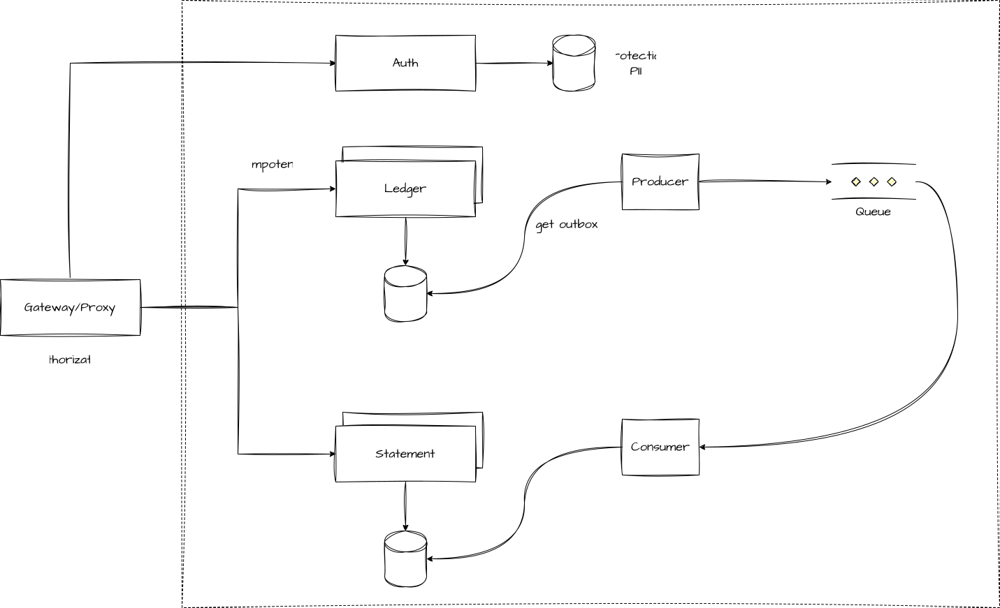

# MerchantCashFlow

O objetivo dessa solução é demonstrar a aplicação de padrões arquiteturas em uma solução para controle de fluxo de caixa diário.

A arquitetura projetada tem como objetivo demonstrar os requisitos funcionais e não funcionais de arquitetura em um ambiente que exige alta confiabilidade, integridade e disponibilidade.



## Architecture Decision Record (ADR)

As decisões de arquitetura estão documentadas no formato **Contexto / Decisão / Alternativas ou Consequências**.

## Decisões de arquitetura (ADR)

Registradas em [docs/adr](docs/adr) no formato *Contexto → Opções consideradas → Decisão → Consequências*.

- [001-organizacao-arquitetura-projeto](adr/001-organizacao-arquitetura-projeto.md)
- [002-arquitetura-orientada-eventos](adr/002-arquitetura-orientada-eventos.md)
- [003-outbox-inbox](adr/003-outbox-inbox.md)
- [004-idempotencia](adr/004-idempotencia.md)
- [005-autenticacao-autorizacao](adr/005-autenticacao-autorizacao.md)
- [006-protecao-dados-pii](adr/006-protecao-dados-pii.md)
- [007-gateway-yarp](adr/007-gateway-yarp.md)
- [008-fragmentacao-banco-dados](adr/008-fragmentacao-banco-dados.md)
- [009-logs](adr/009-logs.md)
- [010-tests](adr/010-tests.md)

## Arquitetura

| Serviço | Responsabilidade | Projetos |
|---|---|---|
| **Auth** | Emite JWT para o comerciante a partir de documento + conta (sem senha; escopo de acesso fixo por comerciante) | `MerchantCashFlow.Auth.Api`, `MerchantCashFlow.Auth.Application` |
| **Ledger** | Registra lançamentos (`Credit`/`Debit`) com idempotência via header `Idempotency-Key`; publica evento via outbox transacional | `MerchantCashFlow.Ledger.Api`, `MerchantCashFlow.Ledger.Application` |
| **Statement** | Consome o evento de lançamento e projeta o consolidado diário (`credit`, `debit`, `balance` computado no banco) | `MerchantCashFlow.Statement.Api`, `MerchantCashFlow.Statement.Application` |
| **Gateway** | Único ponto de entrada (YARP): valida JWT, aplica autorização por escopo (`ledger:write`/`statement:read`), rate limiting, e encaminha a identidade já validada via headers internos | `MerchantCashFlow.Gateway` |
| **Infrastructure** | Biblioteca compartilhada: EF Core, MassTransit/RabbitMQ, Serilog e proteção de dados (PII) | `MerchantCashFlow.Infrastructure` |

Autenticação e autorização são centralizadas no Gateway — os serviços internos recebem os headers `X-Document-Hash`/`X-Account-Number-Hash` encaminhados por ele e não reimplementam validação de JWT.

## Stack principal

- .Net Core 10
- MassTransit (Integração com RabbitMQ)
- Yarp (Gateway/Proxy reverso)
- NBomber (Testes de performance)
- AspNetCore DataProtection (Segurança e PII (Personally Identifiable Information))

## Organização do projeto

```
docs/                     Documentação de arquitetura e ADRs
src/
  Auth/                   Emissão de token
  Ledger/                 Registro de lançamentos + outbox
  Statement/              Projeção do consolidado diário
  Gateway/                YARP: autenticação, autorização, rate limit
  Infrastructure/         Biblioteca compartilhada (EF Core, MassTransit, PII)
tests/
  IntegrationTests/       Testes end-to-end com Testcontainers
  PerformanceTests/       Testes de carga com NBomber
docker-compose.yml        Orquestração local com escala dinâmica
```

## Execução

### Docker Compose

```powershell
cp .env.example .env
docker compose up --build -d
```

O Gateway fica exposto em `http://localhost:8080`.

### Escala dinâmica

`auth-api`, `ledger-api` e `statement-api` não publicam porta no host nem têm `container_name` fixo, para permitir escalar via o próprio Docker Compose:

```powershell
docker compose up --scale ledger-api=3 --scale statement-api=3 -d
```

O Gateway (YARP) aponta cada cluster para o hostname do serviço (ex.: `http://ledger-api:8080/`) com `PooledConnectionLifetime` curto — o DNS interno do Docker faz o round-robin entre as réplicas, e a reconexão periódica do YARP garante que novas réplicas entrem no balanceamento sem reiniciar o Gateway.

## Usuários default para auth

| Document | Account | Scope |
|---|---|---|
|"11111111000191"|"0001-1"|"full"|
|"22222222000172"|"0002-2"|"ledger"|
|"33333333000153"|"0003-3"|"statement"|

## Endpoints

| Método | Rota | Serviço | Autorização |
|---|---|---|---|
| POST | `/api/auth` | Auth | Anônimo |
| POST | `/api/ledger` | Ledger | `ledger:write` |
| GET | `/api/statement` | Statement | `statement:read` |
| GET | `/health` | Todos | Anônimo |

## Fluxo de execução.

1. Emitir um token com um dos usuários default.

   ```http
   POST /api/auth
   { "document": "11111111000191", "accountNumber": "0001-1" }
   ```

2. Registrar um lançamento (requer escopo `ledger:write` ou `full` e header `Idempotency-Key`):

   ```http
   POST /api/ledger
   Authorization: Bearer <token>
   Idempotency-Key: <guid>
   { "type": "Credit", "amount": 150.50 }
   ```

3. Consultar o consolidado do dia (requer escopo `statement:read` ou `full`):

   ```http
   GET /api/statement?date=2026-08-31
   Authorization: Bearer <token>
   ```
## Testes

### Integração
Rodar os testes de integração usando Testcontainers para criar os containers:

```powershell
dotnet test tests/MerchantCashFlow.IntegrationTests
```

### Performance
Precisa disponibilizar a arquitetura completa com `docker compose up`

```powershell
$env:PERFORMANCE_BASE_URL = "http://localhost:8080"
dotnet test tests/MerchantCashFlow.PerformanceTests --filter "Category=Performance"
```

Usa NBomber para realizar teste de carga e mede taxas de erro e os percentis de latência p95 e p99 se estão dentro dos limites configurados.

Ledger: 20 req/s:
 - Error % = 5
 - P95 = 300ms - arbitrário

Statement: 50 req/s
 - Error % = 5
 - P95 = 200ms - arbitrário
 - P99 = 500ms - arbitrário